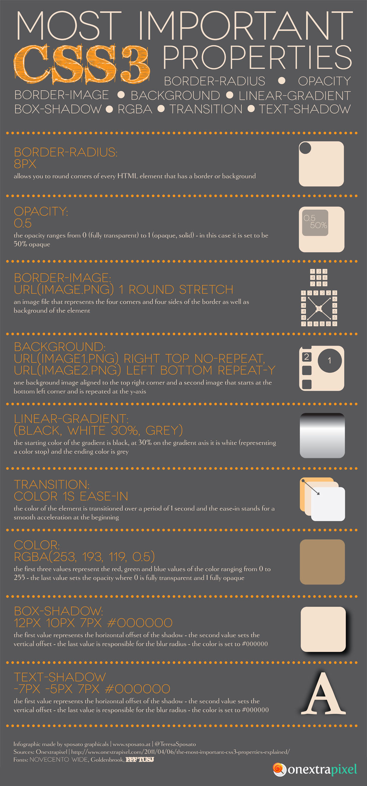

# Front-end design in four-plus hours
Repository for a 4-hour workshop building a responsive website

## About
In this course we are going to be hand-coding a single-page website in valid HTML5 and CSS3. We will be working off of a simple Photoshop Mockup. 
The mockup is designed with a common layout, and is simple enough to teach basic coding techniques and conventions.

## Brushing Up

This CSS infographic was created courtesy of [@TeresaSposato](https://twitter.com/teresasposato).
